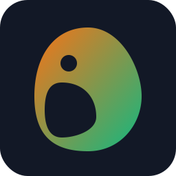
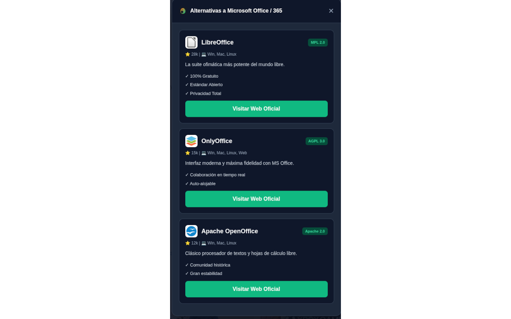

 
# Conciencia Libre
### Educando en Soberanía Tecnológica proactivamente

**Autor:** Antonio José Requena Baena
**Asignatura:** Software Libre y Compromiso Social (UCO)

---

# 1. Filosofía y Objetivo del Proyecto

- **El Problema:** El software libre suele ser "pasivo"; espera a que el usuario lo busque.
- **La Solución:** Una extensión **proactiva** que interviene en el "momento de la decisión".
- **Funcionamiento:** Detecta cuando visitas una web de software privativo y sugiere alternativas libres equivalentes.

💡 <b>Dato para el examen:</b> El objetivo es informar al usuario justo cuando está en el sitio oficial del software propietario.

---

# 2. Tecnologías Utilizadas

- **Manifest V3:** El estándar más moderno para extensiones, priorizando seguridad y rendimiento.
- **Vanilla JavaScript (ES6+):** No se usaron frameworks (React/Angular) para asegurar:
  - Máxima ligereza.
  - Ausencia de dependencias externas.
  - Facilidad de auditoría de código.

---

# 3. Privacidad y Datos (Local First)

- **Procesamiento Local:** La comparación de URLs se hace íntegramente en el navegador.
- **Sin servidores:** No se envía el historial de navegación a ninguna API externa.
- **Base de Datos:** El archivo `alternativas.json` reside dentro del paquete de la extensión.

🔒 <b>Justificación técnica:</b> El uso de una base de datos local garantiza la privacidad absoluta del usuario (Privacy by Design).

---

# 4. Aislamiento con Shadow DOM

**Problema:** Al inyectar nuestro modal en webs externas (ej. Adobe), el CSS de esa web "rompía" nuestro diseño.

**Solución:** Uso de **Shadow DOM API**.
- Crea un árbol DOM encapsulado y aislado.
- Impide que los estilos de la web anfitriona afecten a nuestra interfaz.

---

# 5. Seguridad: Superando la Auditoría

Durante la revisión para **Mozilla Firefox AMO**:
- **Rechazo Inicial:** El uso de `innerHTML` fue detectado como un riesgo de vulnerabilidad **XSS** (Cross-Site Scripting).
- **La Solución:** Sustitución por la API **DOMParser**.
- **Resultado:** Código sanitizado y aprobado por los estándares de seguridad de Firefox y Chrome.

---

# 6. Automatización: El Bot de Datos

Para manejar más de **100 URLs** y logos:
- Se desarrolló un **Bot en Python 3**.
- **Funciones:**
  - Consulta las APIs de **Clearbit** y **Google** para obtener logos.
  - Descarga las imágenes localmente.
  - Genera el `alternativas.json` automáticamente.

---

# 7. ¿Por qué usamos `<all_urls>`?

Para cumplir su fin educativo, la extensión necesita:
1. Leer la URL de la pestaña activa.
2. Compararla con la base de datos local en tiempo real.
3. Este permiso de host global es indispensable para actuar de forma **proactiva**.

⚠️ <b>Nota de estudio:</b> Aunque Google es estricto con este permiso, es necesario para que la detección sea automática y local.

---

# 8. Conclusiones y Licencia

- **Soberanía:** Recuperar el control sobre nuestras herramientas digitales.
- **Licencia:** Distribuido bajo **GNU GPLv3**.
  - Garantiza que el software será siempre libre.
  - Permite auditar, modificar y mejorar el código por la comunidad.

> "Tu libertad termina donde empieza el código que no puedes auditar."

---

# ¡Es tu turno!
### Accede a los recursos y prepárate para el cuestionario

- [📂 Repositorio del Proyecto en GitHub](#)
- [📝 Realizar el Cuestionario de Evaluación](#)
- [🐧 Más sobre Software Libre en la UCO](#)

**Antonio José Requena Baena**
*Universidad de Córdoba*
